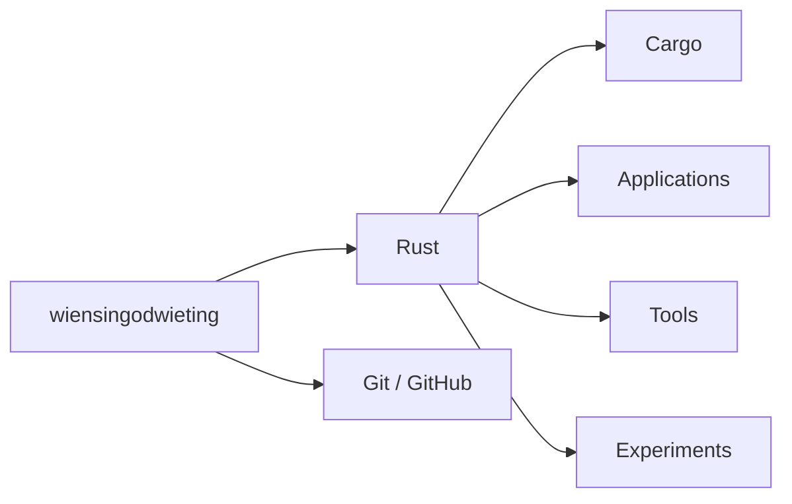

<div align="center">

# wiensingodwieting

<a href="https://git.io/typing-svg">
  
</a>

`Rust` · `Cargo` · `Git` · `Linux / Windows`

</div>

---

## 01 / whoami

```text
name      wiensingodwieting
focus     Rust applications
status    building
mode      learn → build → break → fix
```

I build applications with **Rust** and learn by turning ideas into working software.

No huge portfolio yet. I'm building it one project — and one commit — at a time.

---

## 02 / system map



---

## 03 / currently

```rust
#[derive(Debug)]
struct CurrentState {
    language: &'static str,
    focus: &'static str,
    status: &'static str,
}

fn main() {
    let me = CurrentState {
        language: "Rust",
        focus: "applications",
        status: "compiling...",
    };

    println!("{me:#?}");
}
```

- building applications in Rust
- exploring the Rust ecosystem
- learning better software architecture
- turning random ideas into working software

---

## 04 / projects

```text
01  current build      ███████░░░  in progress
02  next idea          ░░░░░░░░░░  queued
03  ???                ░░░░░░░░░░  waiting for a bad idea
```

Real projects will replace these lines as soon as they're ready.

---

## 05 / activity

<div align="center">


</div>

---

<div align="center">

### `cargo run`

<sub>stay curious · keep building</sub>

</div>
